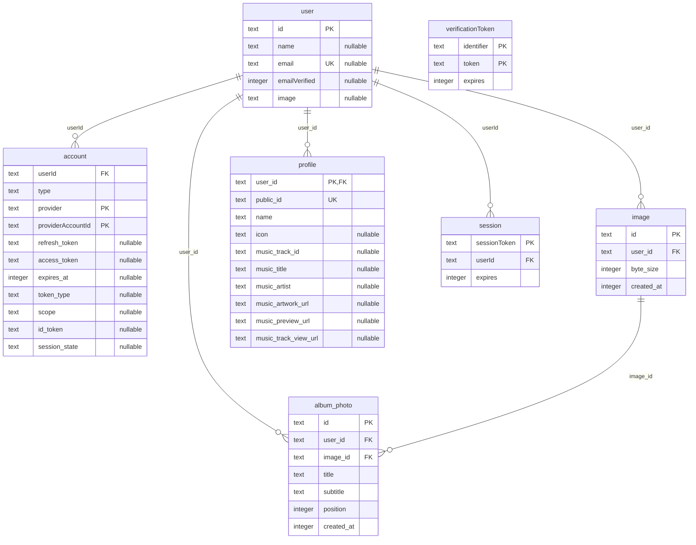

# ER Diagram

Auto-generated from `src/lib/db/schema.ts` via `scripts/gen-erd.ts`.
Run `npm run db:erd` to regenerate. Do not edit by hand.

```mermaid
erDiagram
  account {
    text userId FK
    text type
    text provider PK
    text providerAccountId PK
    text refresh_token "nullable"
    text access_token "nullable"
    integer expires_at "nullable"
    text token_type "nullable"
    text scope "nullable"
    text id_token "nullable"
    text session_state "nullable"
  }
  album_photo {
    text id PK
    text user_id FK
    text image_id FK
    text title
    text subtitle
    integer position
    integer created_at
  }
  image {
    text id PK
    text user_id FK
    integer byte_size
    integer created_at
  }
  profile {
    text user_id PK,FK
    text public_id UK
    text name
    text icon "nullable"
    text music_track_id "nullable"
    text music_title "nullable"
    text music_artist "nullable"
    text music_artwork_url "nullable"
    text music_preview_url "nullable"
    text music_track_view_url "nullable"
  }
  session {
    text sessionToken PK
    text userId FK
    integer expires
  }
  user {
    text id PK
    text name "nullable"
    text email UK "nullable"
    integer emailVerified "nullable"
    text image "nullable"
  }
  verificationToken {
    text identifier PK
    text token PK
    integer expires
  }
  user ||--o{ account : "userId"
  user ||--o{ album_photo : "user_id"
  image ||--o{ album_photo : "image_id"
  user ||--o{ image : "user_id"
  user ||--o{ profile : "user_id"
  user ||--o{ session : "userId"
```
